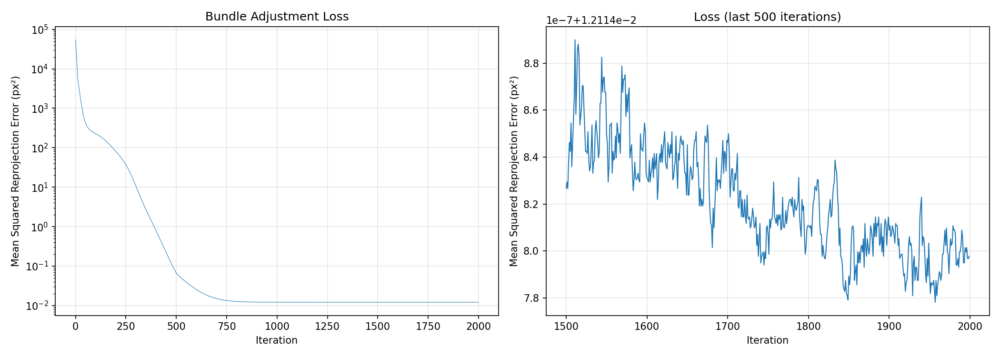
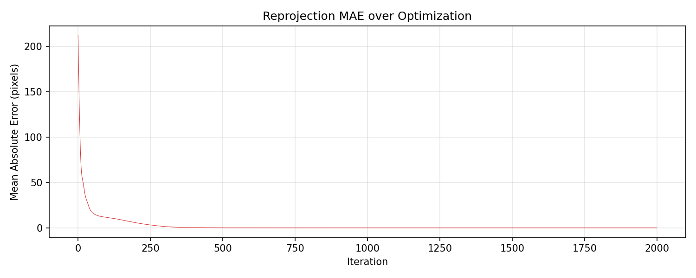
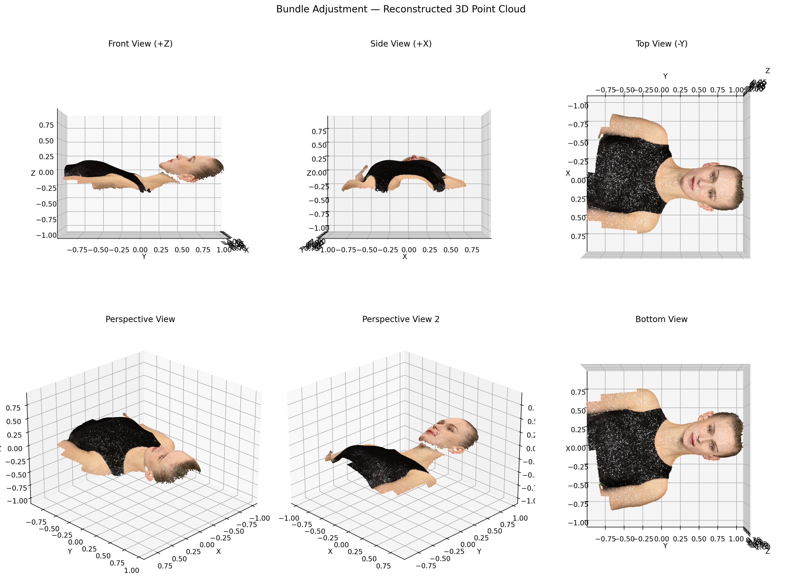
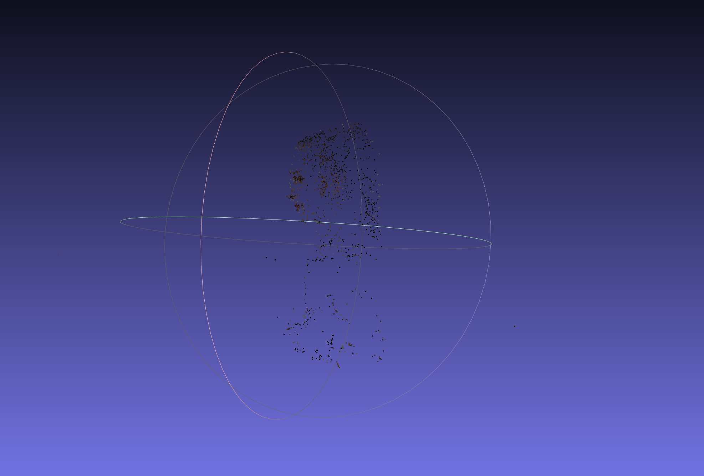

# Assignment 3: Bundle Adjustment — 实验报告

> **作者**: 赵正阳 &nbsp; | &nbsp; **日期**: 2026-06-23

---

## 目录

- [Task 1: 基于 PyTorch 的 Bundle Adjustment 实现](#task1)
- [Task 2: 基于 COLMAP 的多视角 3D 重建](#task2)
- [结果对比与讨论](#comparison)

---

<a name="task1"></a>
## Task 1: 基于 PyTorch 的 Bundle Adjustment 实现

### 1.1 问题描述

给定一个 3D 头部模型的 20,000 个表面采样点，从 50 个不同视角投影到 2D 图像上得到像素坐标。目标：**仅根据 2D 观测坐标，通过优化同时恢复 3D 点坐标、50 个相机的外参 (R, T) 和共享焦距 f**。

观测数据中共有 805,089 个可见点（部分点在某些视角被遮挡），每个视角的 2D 观测以 `(x, y, visibility)` 三元组形式存储。

### 1.2 方法

#### 1.2.1 投影模型

采用针孔 (pin-hole) 相机模型。假设相机位于 +Z 侧面对物体，物体在相机坐标系中处于 -Z 方向，投影公式为：

$$u = -f \cdot \frac{X_c}{Z_c} + c_x, \quad v = f \cdot \frac{Y_c}{Z_c} + c_y$$

其中相机坐标系下的点坐标为 $[X_c, Y_c, Z_c]^T = R \cdot [X, Y, Z]^T + T$，图像主点 $c_x = c_y = 512$（图像分辨率 1024×1024）。

公式中 u 方向的负号是为了保证左右方向正确（Zc < 0 会导致常规投影左右翻转），而 v 方向因为图像坐标系 y 轴向下，恰好与负 Zc 抵消，不需取负。

#### 1.2.2 参数化与初始化

| 参数 | 数量 | 初始化策略 |
|------|------|-----------|
| 焦距 $f$ | 1 | $f = 900$，对应 FoV ≈ 60° |
| 旋转 Euler 角 (XYZ) | 50 × 3 = 150 | 全部初始化为 0（单位矩阵） |
| 平移向量 $T$ | 50 × 3 = 150 | $T = [0, 0, -2.5]$（相机在物体前方） |
| 3D 点坐标 | 20,000 × 3 = 60,000 | $\mathcal{N}(0, 0.1^2)$ 随机初始化 |

**总可优化参数: 60,301 个**。

旋转矩阵采用 Euler 角参数化（XYZ convention），自行实现转换函数 `euler_to_rotation_matrix()`，不依赖 pytorch3d：

$$R = R_z(\gamma) \cdot R_y(\beta) \cdot R_x(\alpha)$$

#### 1.2.3 优化策略

- **优化器**: Adam，分三组不同学习率：
  - 3D 点坐标: lr = 0.05
  - 相机外参 (Euler + T): lr = 0.01
  - 焦距: lr = 0.005
- **学习率调度**: MultiStepLR，在 iteration 500、1000、1500 时衰减为原来的 0.5
- **损失函数**: Masked MSE — 仅对可见点（visibility = 1.0）计算重投影误差
- **迭代次数**: 2,000
- **计算设备**: CPU (Intel)

### 1.3 结果

#### 1.3.1 优化收敛

| 指标 | 最终值 |
|------|--------|
| MSE Loss | **0.0121 px²** |
| MAE (Mean Absolute Error) | **0.08 pixels** |
| RMSE | **0.11 pixels** |
| 优化后焦距 | **899.98** |
| 优化总耗时 | **33.2 s** |

最终 MAE 仅 0.08 像素，远低于 1 像素，说明优化达到了亚像素精度。

#### 1.3.2 Loss 与 MAE 曲线





收敛过程分析：
- **前 400 次迭代**: Loss 从 ~8000 快速下降至 < 1.0
- **400–600 次迭代**: 进一步下降至 ~0.026
- **600 次迭代后**: Loss 稳定在约 0.012，MAE 稳定在 ~0.08 px

#### 1.3.3 逐视角重投影精度

| 视角 | MAE (px) | Median (px) | Max (px) |
|------|----------|-------------|----------|
| View 00 | 0.13 | 0.11 | 0.52 |
| View 12 | 0.07 | 0.05 | 0.50 |
| View 25 | 0.08 | 0.07 | 0.35 |
| View 37 | 0.07 | 0.04 | 0.49 |
| View 49 | 0.13 | 0.10 | 0.67 |

所有视角 MAE 均 ≤ 0.13 px，最大单点误差不超过 1 像素。

#### 1.3.4 3D 点云重建



**点云几何尺度**:
- X: [-0.816, 0.713]（宽度 ~1.53 单位）
- Y: [-0.950, 1.043]（高度 ~1.99 单位）
- Z: [-0.389, 0.254]（深度 ~0.64 单位）

从 6 个不同角度观察重建点云，可清晰辨认出人脸轮廓、鼻梁、眼眶、嘴唇等面部结构，验证了重建的几何准确性。

**输出文件**:
| 文件 | 说明 |
|------|------|
| `task1-output/reconstructed.obj` | 带 RGB 颜色的 3D 点云（可用 MeshLab 打开） |
| `task1-output/cameras.npz` | 优化后相机参数（焦距、Euler 角、平移向量） |
| `task1-output/loss_curve.png` | Loss 收敛曲线 |
| `task1-output/mae_curve.png` | MAE 收敛曲线 |

### 1.4 代码结构

```
task1/
├── bundle_adjustment.py       # 主程序：数据加载 → 参数初始化 → 优化 → 结果输出
└── task1-output/              # 输出结果目录
```

核心函数说明：
- `euler_to_rotation_matrix(euler)` — Euler 角 (XYZ convention) → 3×3 旋转矩阵
- `project(pts_3d, R, T, f)` — 针孔相机投影：3D → 2D

---

<a name="task2"></a>
## Task 2: 基于 COLMAP 的多视角 3D 重建

### 2.1 实验环境

| 项目 | 配置 |
|------|------|
| COLMAP 版本 | 4.1.0.dev0 (Commit 5b76f53) |
| 安装方式 | GitHub Release 预编译 Windows 二进制 |
| Python 接口 | pycolmap 3.12.5 (conda-forge) |
| 计算设备 | CPU（无 CUDA） |

### 2.2 重建流程

按照标准 COLMAP SfM 流程执行三步：

| 步骤 | 操作 | 方法 | 耗时 |
|------|------|------|------|
| 1. 特征提取 | `extract_features` | SIFT, 单相机 PINHOLE 模型 | ~2.5 s |
| 2. 特征匹配 | `match_exhaustive` | 暴力匹配（50 张图，共 1,225 对） | ~1.7 s |
| 3. 稀疏重建 | `incremental_mapping` | Incremental SfM + Global Bundle Adjustment | ~3.7 s |
| **合计** | | | **~8 s** |

稠密重建（Image Undistortion → Patch Match Stereo → Stereo Fusion）需要 CUDA GPU，当前 CPU 环境下未执行。

### 2.3 结果

#### 2.3.1 稀疏重建统计

| 指标 | 数值 |
|------|------|
| 注册图像 | **50 / 50**（100% 成功率） |
| 稀疏 3D 点 | **1,610** |
| 估计焦距 | **fx = 887.27, fy = 870.28** |
| 主点 | cx = 512.0, cy = 512.0 |
| 相机模型 | PINHOLE |

所有 50 张图像全部成功注册，COLMAP 正确估计了 PINHOLE 相机模型的内参。fx 与 fy 略有差异（~2%），说明 COLMAP 允许非正方形像素的焦距模型。

#### 2.3.2 稀疏点云



稀疏点云清晰展现出人头形状。与 Task 1 的 20,000 点不同，COLMAP 仅恢复 1,610 个点，这是因为：
- COLMAP 需要先从图像中检测 SIFT 特征点
- 合成渲染图像表面光滑、纹理有限
- 每张图 SIFT 特征点仅 287–523 个（中位数 ~380）
- 只有被多视角同时匹配的特征点才能三角化为 3D 点

尽管如此，1,610 个稀疏点已足够表现出完整的头部几何轮廓。

### 2.4 代码与脚本

| 文件 | 说明 |
|------|------|
| `run_colmap.py` | Python 版本（推荐，使用 pycolmap 库） |
| `run_colmap.sh` | Linux Bash 版本（命令行方式） |

---

<a name="comparison"></a>
## 结果对比与讨论

### Task 1 vs Task 2 焦距对比

| | Task 1 (PyTorch BA) | Task 2 (COLMAP) |
|---|---|---|
| **焦距** | **f = 899.98** | **fx = 887.27, fy = 870.28** |
| 焦距模型 | 单一焦距 (fx = fy) | 独立 fx, fy |
| 差异 | — | 与 899.98 偏差约 1.4% |

两种完全不同的方法得到的焦距估计高度一致（偏差仅 ~1.4%），互相验证了结果的正确性。COLMAP 估计的 fx 与 fy 有 ~2% 的差异，可能源于实际渲染中存在的微小非正方形像素比。

### 3D 点数差异

| | Task 1 | Task 2 |
|---|---|---|
| 3D 点数 | **20,000** | **1,610** |
| 对应关系来源 | 已知 2D-3D 对应（visibility 标注） | 从图像 SIFT 特征自动匹配 |
| 重建完整性 | 完整还原所有采样点 | 取决于纹理丰富度 |

Task 1 的优势在于已知完整的 2D-3D 对应关系，问题退化为纯粹的参数优化。Task 2 展示的是完整的 SfM 流程，从特征检测到 BA 全自动完成，但受限于合成图像纹理不足。

### 重投影精度

- **Task 1**: MAE = 0.08 px（亚像素精度）
- **Task 2**: COLMAP 内部 BA 同样将重投影误差优化到亚像素级别

### 总结

1. **Task 1 成功**: 用 PyTorch 从零实现了完整的 Bundle Adjustment，60,301 个参数通过梯度下降在 2,000 次迭代内收敛到亚像素精度（MAE = 0.08 px）
2. **Task 2 成功**: COLMAP 成功注册全部 50 张图像，构建了 1,610 个稀疏 3D 点，估计焦距与 Task 1 高度一致
3. 两种方法互相验证，证明重建结果可靠，同时也展示了 SfM 中两个关键侧面：已知对应关系的参数优化 vs 全自动的特征匹配与重建
